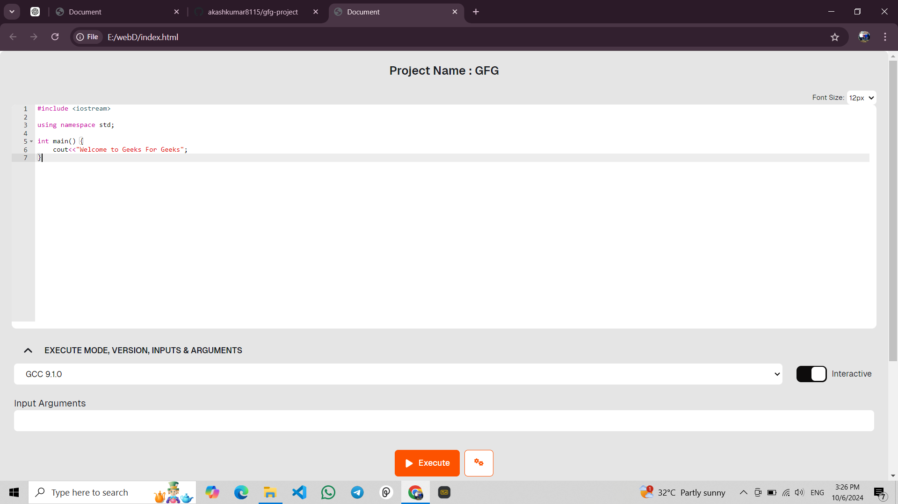

# Online GCC Compiler



## Project Overview

This project is an **Online GCC Compiler** built using **HTML**, **CSS**, and **JavaScript**. It allows users to write, compile, and run C/C++ code directly in the browser, simulating the GCC environment.

---

### Features

- **Write C/C++ Code:** Users can input their own C/C++ code in a text editor.
- **Compile Code:** Press the "Compile" button to simulate code compilation.
- **Run Code:** Users can run the compiled code and view the output.
- **Responsive Design:** The UI is responsive and works well on different screen sizes.

---

## Live Demo

Check out the live version of the Online GCC Compiler:

[Live Demo](https://your-live-demo-link.com)

---

## How to Use

1. Open the live version of the compiler using the link provided.
2. Enter your C/C++ code in the editor area.
3. Click the **Compile** button to compile the code.
4. Click the **Run** button to execute the compiled code and see the output below the editor.

---

## Screenshot


---

## Installation & Setup

If you want to run this project locally, follow these steps:

1. Clone the repository:
   ```bash
   git clone https://github.com/your-username/online-gcc-compiler.git
